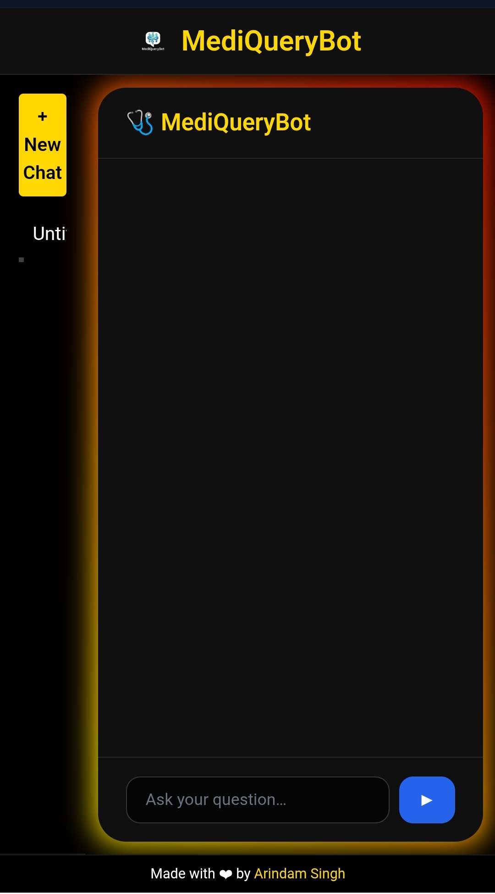

# 🩺 MediQueryBot [ [Live](https://huggingface.co/spaces/ArindamSingh/MediQuery) | [GitHub](https://github.com/SinghArindam/MediQueryBot) ]

A sleek, glass-morphic medical-query chatbot that can switch between Custom Finetuned LLMs, Hugging Face models (Qwen-3 0.6 B, Gemma3-1 B), locally-quantised GGUF models served with llama.cpp, and Google Gemini-Flash 2.5.
Mobile-responsive, supports multiple simultaneous chats, Markdown answers, collapsible reasoning, latency tracking and an AMOLED dark theme with an animated gradient glow.

---

## Journey \& version history

| Version | Date (2025) | Highlights |
| :-- | :-- | :-- |
| **v1.0** | Jun 14 | First public release – Qwen-3 0.6 B + glass-morphic UI |
| **v1.1** | Jun 15 | Multi-chat sidebar, per-chat JSON persistence |
| **v1.2** | Jun 16 | Latency timer and footer stored with messages |
| **v1.3** | Jun 17 | Markdown rendering, collapsible `<think>` reasoning |
| **v1.4** | Jun 18 | Multi-model: Gemma-1 B, Mistral-7B Q4_K_M (llama.cpp) |
| **v1.5** | Jun 19 | Gemini API integration + `/models` endpoint for dynamic dropdown |
| **v1.6** | Jun 20 | Fully responsive mobile layout, sidebar ➜ ribbon |

---

## Features

- **Multi-LLM switcher** – choose Qwen, Gemma, any GGUF quant (auto-downloaded) or Gemini via API key.
- **Multi-chat** – separate histories saved as `backend/chats/<id>.json`.
- **Markdown answers** – headings, lists, code blocks, tables.
- **💭 Reasoning toggle** – hides chain-of-thought until user expands it.
- **Latency footer** – “Responded in X s” shown and logged.
- **AMOLED UI** – pure-black background, glass card, animated red→blue→green→gold glow.
- **100 % responsive** – desktop sidebar collapses into a top ribbon on ≤ 640 px.

---

## Directory structure

```
backend/
  main.py              FastAPI + model loader
  requirements.txt
  models/              ⬇ GGUF files auto-downloaded here
  chats/               ↳ per-chat JSON histories
frontend/
  index.html           glass UI + responsive CSS
  script.js            dynamic dropdown, Markdown, latency
  logo.png             replace with your own PNG
Dockerfile
.env.example           set GEMINI_API_KEY here
README.md
```


---

## Quick start

### 1 Docker (recommended)

```bash
git clone https://github.com/yourname/mediquerybot.git
cd mediquerybot
cp .env.example .env          # add GEMINI_API_KEY if you have one
docker build -t mediquery .
docker run -p 7860:7860 mediquery
# open http://localhost:7860
```


### 2 Python dev mode

```bash
python -m venv .venv && source .venv/bin/activate
pip install -r backend/requirements.txt
uvicorn backend.main:app --reload
# then   cd frontend && python -m http.server
```


---

## Deployment on Hugging Face Spaces (Docker runtime)

1. Create a new **Docker** Space.
2. Push the entire repo (`git push`).
3. Add `GEMINI_API_KEY` in the Space secrets if you want Gemini.
First build downloads HF checkpoints (~1–2 GB) and the selected GGUF file.

---

## Configuration

| Task | How |
| :-- | :-- |
| Add / remove models | Edit `MODEL_REGISTRY` in `backend/main.py`. |
| Swap a GGUF file | Drop it in `backend/models/` and update its dict entry. |
| Change default model | `DEFAULT_MODEL` constant in `main.py`. |
| Restrict CORS | Edit `allow_origins` when instantiating `CORSMiddleware`. |
| Hide thinking entirely | Remove `enable_thinking=True` + `<think>` stripper. |


---

## Environment variables

| Variable | Purpose |
| :-- | :-- |
| `GEMINI_API_KEY` | Enables Gemini calls. If absent, Gemini is hidden from `/models`. |

Put them in `.env` (read via python-dotenv) or set in your orchestration UI.

---

## API summary

```
GET  /models                  # [{id,label}]
POST /chats?model_id=...      # → {id,created_at,model_id}
GET  /chats                   # sidebar list
GET  /chats/{id}/history      # full message array
POST /chats/{id}/ask          # {reply,latency,model_id}
```


---

## Screenshots

| Desktop | Mobile |
| :-- | :-- |
|  |  |


### DeskTop


### Mobile


---

## License

MIT License

Copyright (c) 2025 SinghArindam

---

Made with ❤ by **Arindam Singh**!